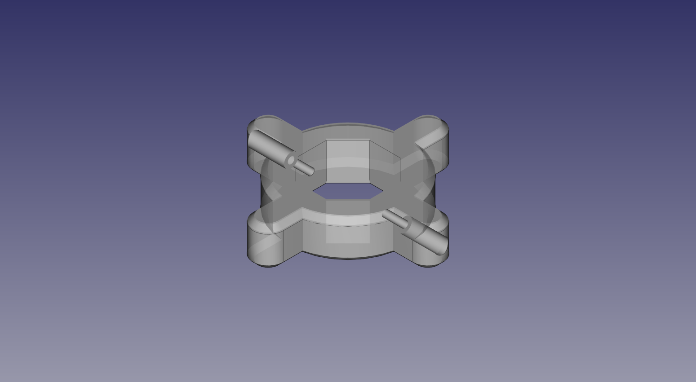

# hose_knob
knob for the female end of a hose for tool free connections

What:

	A parametric model of a knob for tool free hose connections.
	This adds "fingers" to the female end of the hose so you can exert
	a large force on the connector without using tools.
	
	

Status:
	Hex and Octo versions printed, and seem to work well.  Still messing with them, round version not finished yet 
	
``` 
  
	Standard Disclaimer:
		If you have more than a casual interest in this project you should contact me 
		( no_spam_please_666 at comcast.net )and see if the repository is actually in good shape.  
		I may well have improved software and or documentation.  
		I will try to answer all questions and perhaps even clean up what already exists.	
``` 		
Documentation:
	


------------------------- development environment ------------------


OS: Windows 10
Word size of OS: 64-bit
Word size of FreeCAD: 64-bit
Version: 0.18.15959 (Git)
Build type: Release
Branch: master
Hash: 397418078a6f61e8c39cedfe1160adc2abd73510
Python version: 2.7.14
Qt version: 4.8.7
Coin version: 4.0.0a
OCC version: 7.2.0
Locale: English/UnitedStates (en_US)
